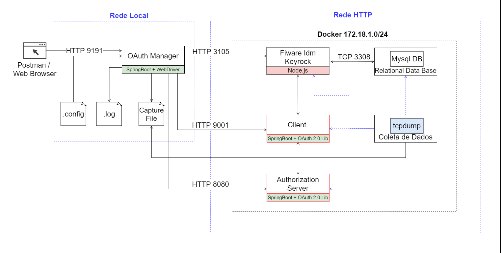
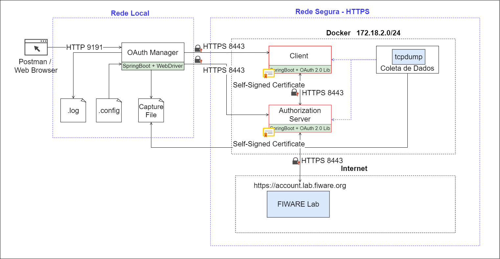

# Oauth FIWARE

System for detecting and analyzing three categories of OAuth 2.0 vulnerabilities (CSRF, AS Mix-Up e 307 Redirect), 
running over the HTTP/HTTPS protocol in FIWARE.

### Requirements

Install <b>Docker</b>: https://docs.docker.com/engine/installation/

Install <b>docker-compose</b>: https://docs.docker.com/compose/install/

Install <b>Java 11</b>: https://www.oracle.com/java/technologies/javase-jdk11-downloads.html

Install <b>Maven</b>: https://maven.apache.org/install.html

Download <b>ChromeDriver</b>: https://chromedriver.chromium.org/downloads

## Architecture HTTP Overview 



## How-to


### Installation

Clone project: 
```
$ git clone https://github.com/gilsonsf/oauth-fiware.git
```

Run fiware-idms:
```
$ cd oauth-fiware/fiware-idm
$ sudo docker-compose up
```
Run oauth-manager:
```
$ cd oauth-fiware/oauth-manager/target
$ java -jar oauth-manager-0.0.1-SNAPSHOT.jar --spring.config.location=<PATH>
NOTE: The <PATH> is located at \oauth-fiware\application.yml file. Check that the paths are correct within the file.
```
## Architecture HTTPS Overview 



## How-to

### Requirements